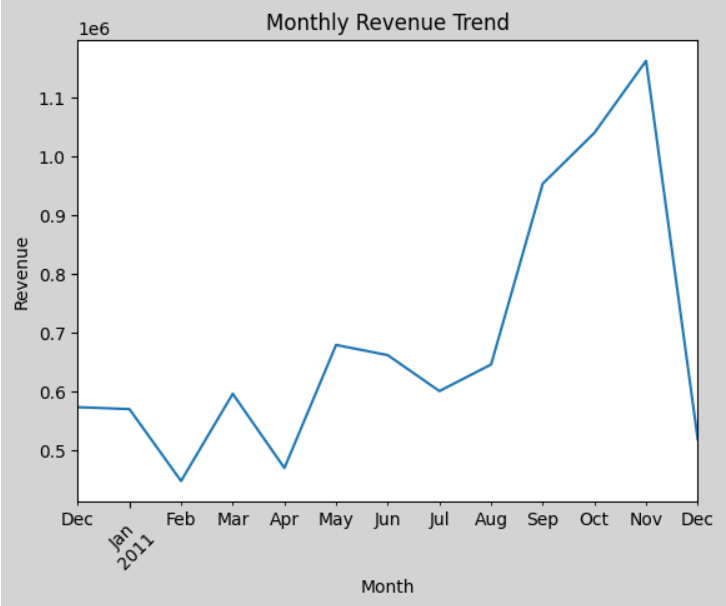
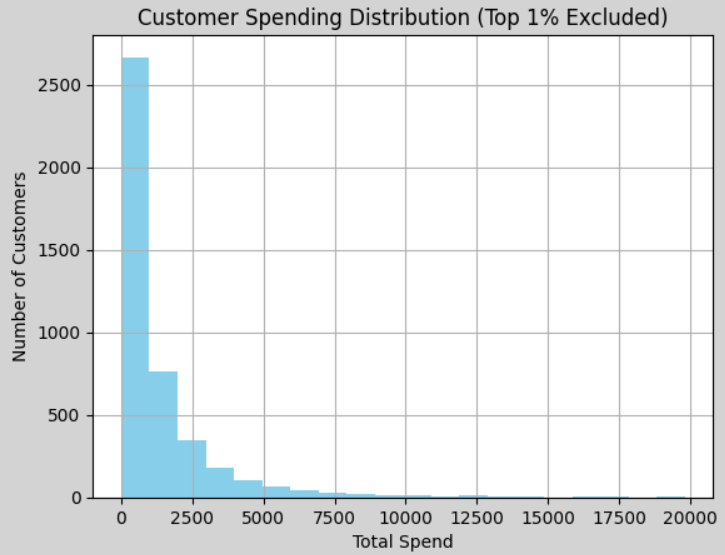
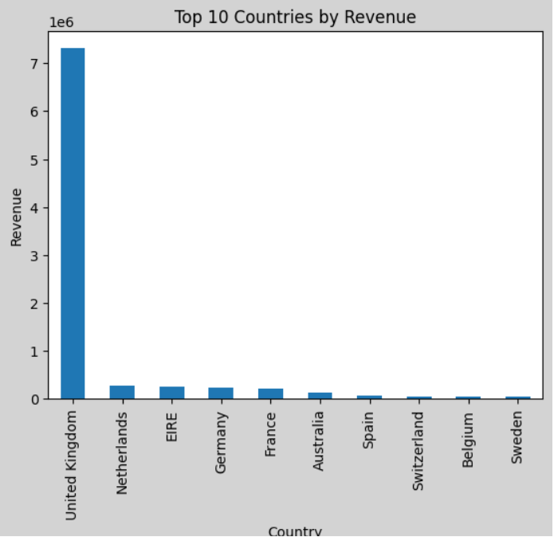
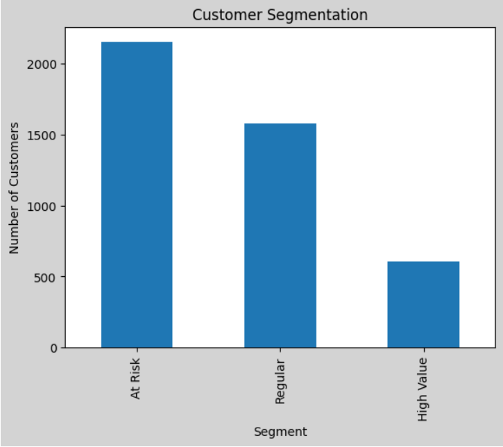
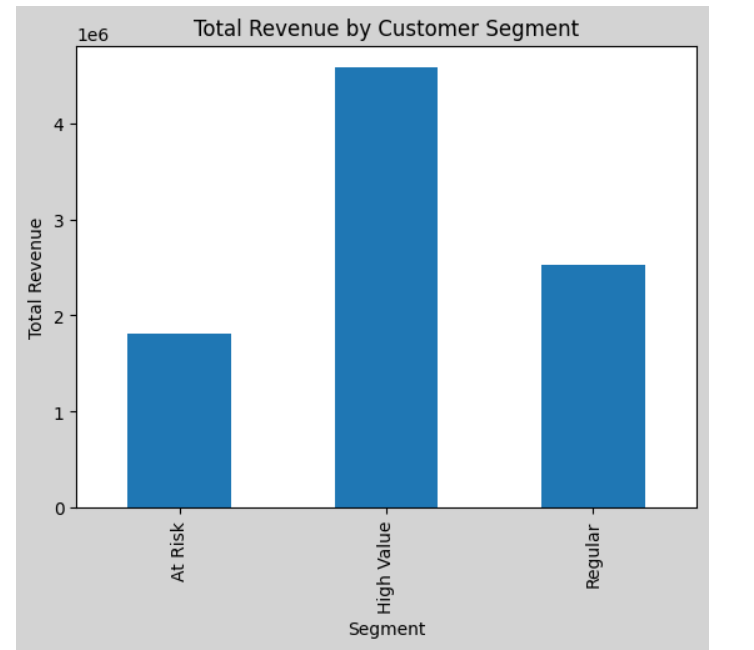

## 📊 E-commerce Customer Analytics

Analyze customer purchasing behavior using EDA and RFM segmentation.

### Key Insights
- Monthly revenue trends
- Customer spending distribution
- Top countries by revenue
- Customer segmentation

- ## 1. Monthly Revenue Trend

Monthly revenue shows a clear upward trend in the second half of the year, peaking in November, followed by a sharp drop in December.

This pattern suggests strong seasonality, likely driven by holiday shopping behavior (e.g., Black Friday / pre-Christmas demand). The post-peak decline may indicate demand saturation or reduced purchasing activity after major sales periods.

---

## 2. Customer Spending Distribution

Customer spending follows a highly right-skewed distribution, even after excluding the top 1% of customers.

This indicates that the majority of customers contribute relatively low revenue, while a small group of high-value customers drives a disproportionate share of total revenue.

The long tail suggests strong customer heterogeneity, highlighting the importance of segmentation strategies such as RFM analysis to identify and target high-value users.

## 3. Revenue by Country

Revenue is heavily concentrated in the United Kingdom, which significantly outperforms all other countries by a large margin.

This indicates a strong geographic dependency, where the business relies predominantly on a single market. Other countries contribute relatively small and fragmented portions of total revenue, suggesting limited international penetration.

Such concentration introduces potential risk exposure, as fluctuations in the UK market could disproportionately impact overall performance. Expanding and diversifying into other high-potential regions may help mitigate this risk and unlock additional growth opportunities.

## 4. Customer Segmentation (RFM Analysis)

Customer segmentation reveals a clear imbalance in both customer distribution and revenue contribution across segments.

The majority of customers fall into the "At Risk" and "Regular" segments, while the "High Value" group represents a relatively small portion of the customer base. However, despite its smaller size, the High Value segment contributes the largest share of total revenue.

This indicates a strong value concentration, where a limited group of loyal, high-frequency customers drives a disproportionate amount of business performance. In contrast, the large At Risk segment contributes relatively low revenue, suggesting significant untapped potential if re-engagement strategies are applied.

The mismatch between customer count and revenue contribution highlights the importance of targeted customer management strategies, focusing both on retaining high-value users and activating at-risk customers to improve overall revenue efficiency.

### Tech Stack
Python, SQL, Tableau
